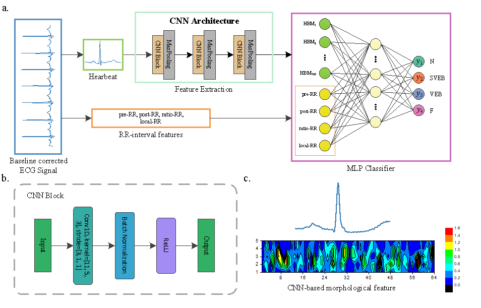

# Code for: Focal Loss-Based Deep Neural Network for Heartbeat Classification
## Abstract

Heart arrhythmia, as one of the most important cardiovascular diseases (CVDs), has gained a wide attention in the past two decades. This paper proposes a deep neural network with focal loss for heartbeat classification. The proposed method uses both the morphological characteristics and dynamic information of the heartbeat at the same time, where the morphological characteristics are extracted through a convolutional neural network. This is because the morphological characteristics of patients have inter-patient variations, which makes it difficult to accurately describe using traditional hand-craft ways. Meanwhile, considering the impact of imbalanced class distribution on performance, a focal loss function is introduced to solve this problem in the paper. By testing in the MIT-BIH arrhythmia database based on the AAMI standard, our method achieves an overall PPV of 65.85%, SE of 68.26%, F1 of 66.83%, and accuracy of 97.53%. Compared with existing heartbeat classification methods, the performance of our method has been significantly improved. Our method is simple yet effective, which is potentially used for personal automatic heartbeat classification in remote medical monitoring. 

## Dataset

[MIT-BIH Arrhythmia database](https://www.physionet.org/content/mitdb/1.0.0/)

## Usage

- Reproduce the results

> A pre-trained model is provided in the model directory. To reproduce our results, you should, first, download the MIT-BIH arrhythmia database from the above link and save it in the dataset directory. Then, execute  `preprocessing.py` to obtain the training and test dataset. After that, just run `pre-training.py` and you will get the results of our paper.

- Re-train the model

> Just replace the last step of run `pre-training.py` with `main.py`.
>
> Noted that the optimization function of Keras and TensorFlow is slightly different in different versions. Therefore, to reproduce our results, it suggests that using the same version of Keras and TensorFlow as us, in our work the version of Keras is  2.3.1 and TensorFlow is 1.15.0. In addition, Keras and TensorFlow have a certain randomness, the actual results may be somewhat floating.  

## Cite

The paper is submitted to the journal for review. 

## Email:

If you have any questions, please email to: [wtustc@mail.ustc.edu.cn](mailto:wtustc@mail.ustc.edu.cn)
